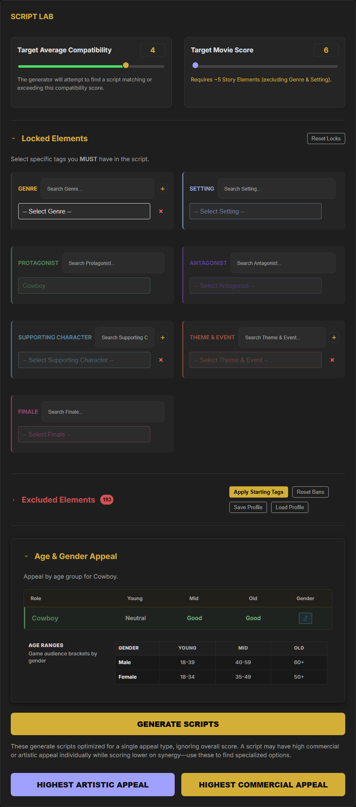
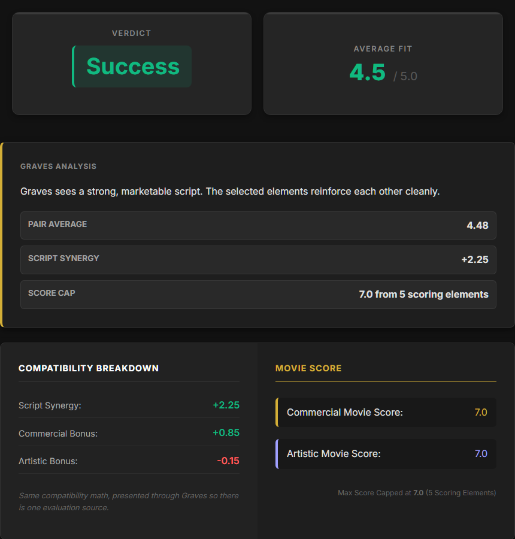
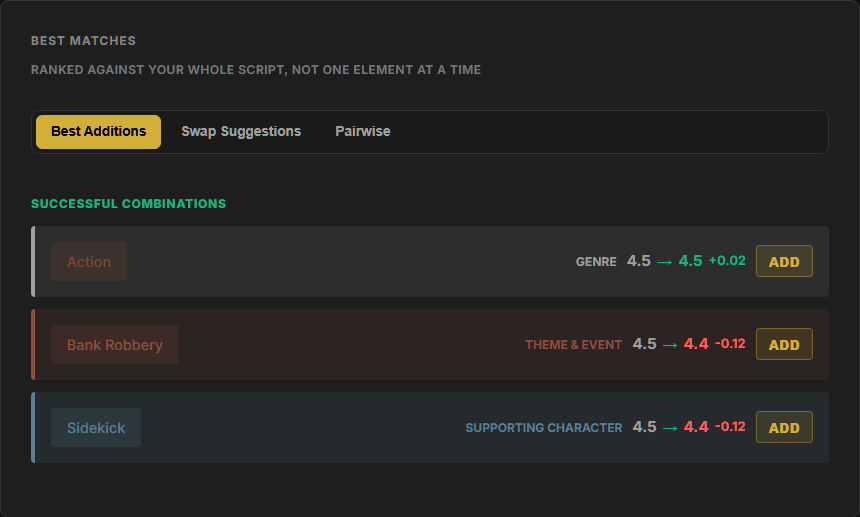
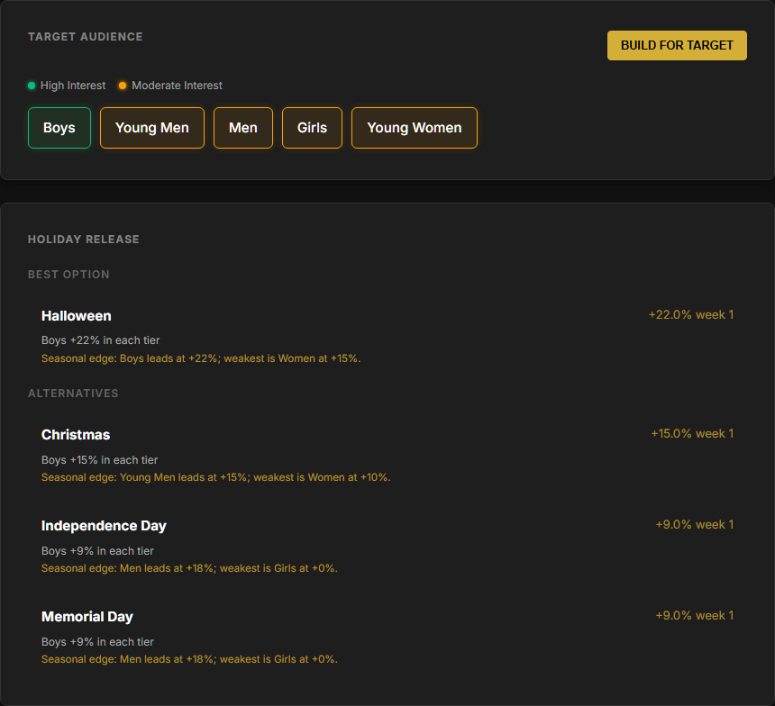
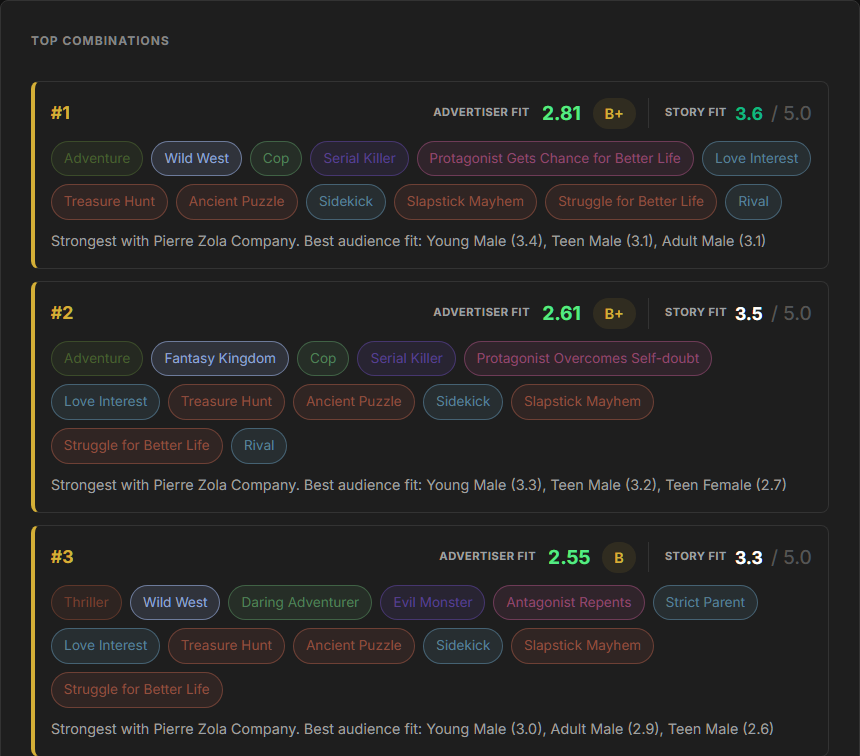
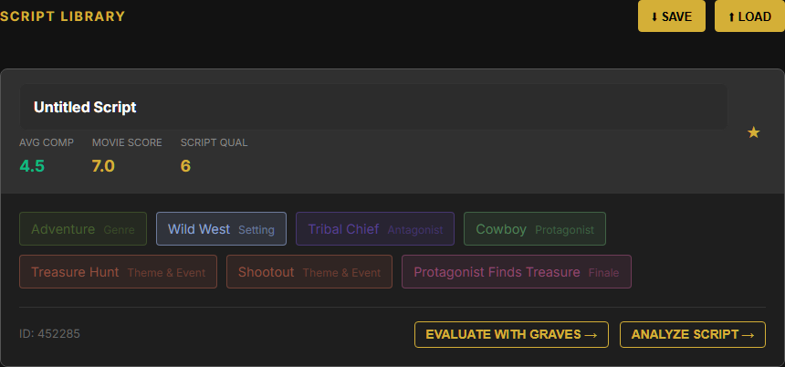

# Hollywood Animal Extended

**Built and maintained by Arber Bakalli**

Unofficial companion tool for **Hollywood Animal** players. It helps plan scripts,
evaluate story-element fit, estimate movie scores, pick advertisers, and forecast
release demand using extracted game data where available.

A plain static web app built from scratch: no framework, no bundler, no build step.
The app is organized into classic scripts under `src/`.

[Open the live app](https://arberbakalli.github.io/hollywood-animal-extended/)

## Screenshots

Captured from the local working version on 26 September 2026 using real game
data. These previews can include changes not yet deployed to the live app.
Capture details and refresh instructions: [screenshots](docs/screenshots/README.md).

<details>
<summary>Script Lab: generation settings, global exclusions, locked roles and Age & Gender Appeal</summary>



</details>

<details>
<summary>Colman Graves: verdict, compatibility breakdown and potential movie scores</summary>



</details>

<details>
<summary>Colman Graves: Best Matches and available additions</summary>



</details>

<details>
<summary>Marketing & Release: target audiences and holiday opportunities</summary>



</details>

<details>
<summary>Build for Target: ranked script combinations (excerpt)</summary>



</details>

<details>
<summary>Script Library: expanded saved script and transfer controls</summary>



</details>

## Features

### Script Lab

- Generate candidate scripts from selected genres, setting and story elements.
- Lock must-have elements so every generated script keeps them.
- Maintain a global Excluded Elements list used by Script Lab, Colman Graves,
  Marketing & Release and Build for Target.
- Apply the Starting Tags deck, edit exclusions as new elements unlock, and
  save/load exclusion lists.
- Generate specialized high-artistic or high-commercial script options.
- View Age & Gender Appeal for selected roles.
- Pin scripts into the Script Library, then export/import the library as JSON.

### Colman Graves

- Evaluate a script with required Genre, Setting and Protagonist rules.
- Show average fit, script synergy, commercial/artistic bonuses and potential
  movie score.
- Explain conflicts and pair analysis by success band.
- Generate Best Matches from one or more seed elements without requiring a full
  script.
- Explore Best Additions, Swap Suggestions and Pairwise views.
- Filter suggestions by category and minimum fit; global exclusions determine
  which elements are available.
- Transfer evaluated scripts into Marketing & Release.

### Marketing & Release

- Analyze a script for target audiences and movie lean.
- Estimate weekly distribution demand from the commercial score.
- Apply studio policy toggles:
  - Behemoth: 25% demand boost, with slower decay gated by commercial score.
  - Boutique: slower decay gated by artistic score.
  - Factory Policy: shorter pre-release advertising run.
- Recommend advertisers from the game's agency targeting data (`data.js`,
  checked against the extracted `AdsAgents.json`).
- Recommend holiday release windows using `data/Holidays.json`, including
  demographic-specific tier messaging and opening-week demand impact.
- Save analyzed scripts to the Script Library.

### Build for Target

- Search for strong scripts by audience or advertiser target.
- Let advertiser selection override audience selection when needed.
- Lock optional elements into the search.
- Respect global exclusions and the same story-element budget rules as the rest
  of the app.
- Rank combinations by advertiser fit.

## Game Data Notes

- `docs/GAME_RULES.md` records the current product rules and source-of-truth
  decisions.
- Extracted game files live under `extractedFilesFromGameSourceOfTruth/`.
- Holiday release bonuses are loaded from `data/Holidays.json`.
- Scenario files in `tests/scenarios/` are the behaviour map. Tests should guard
  behaviour, not be rewritten only to make failing code pass.

## Running Locally

The app is static, but it fetches JSON files at runtime. Open it through the
local server, not `file://`.

```bash
npm install
npm run serve
```

Then open:

```text
http://127.0.0.1:4173
```

## Testing

```bash
npm test -- --runInBand --roots tests
npm run test:e2e
```

Useful focused checks:

```bash
npm test -- --runInBand --roots tests --testPathPattern=holiday-release
npm test -- --runInBand --roots tests --testPathPattern=age-role-breakdown
npx playwright test tests/e2e/marketing-release.spec.js
```

`--roots tests` keeps Jest scoped to this checkout's suite, excluding nested
agent worktrees. Passing tests are one verification layer, not proof that every
BDD scenario or production workflow is covered.

## Repo-Wide Review Passes

The review skills/checks we wanted to run before calling the feature set done:

- `karpathy-guidelines`: keep changes surgical, simple and verifiable.
- `frontend-design`: full HTML/CSS/UI consistency pass.
- `playwright`: browser verification for important workflows and screenshots.
- BDD best-practices review: make sure `tests/scenarios/*.feature` describe real
  user behaviour and that automated tests honestly cover them.
- Jest/unit-test quality review: make sure tests call production code, avoid toy
  simulations and protect high-risk rules.

Game data and localisation files originate from Hollywood Animal itself and
belong to its developers.

Inspired by [CallOn84/Hollywood-Animal-Calculator](https://github.com/CallOn84/Hollywood-Animal-Calculator).

## License

GNU General Public License v3.0. See [LICENSE](LICENSE).
